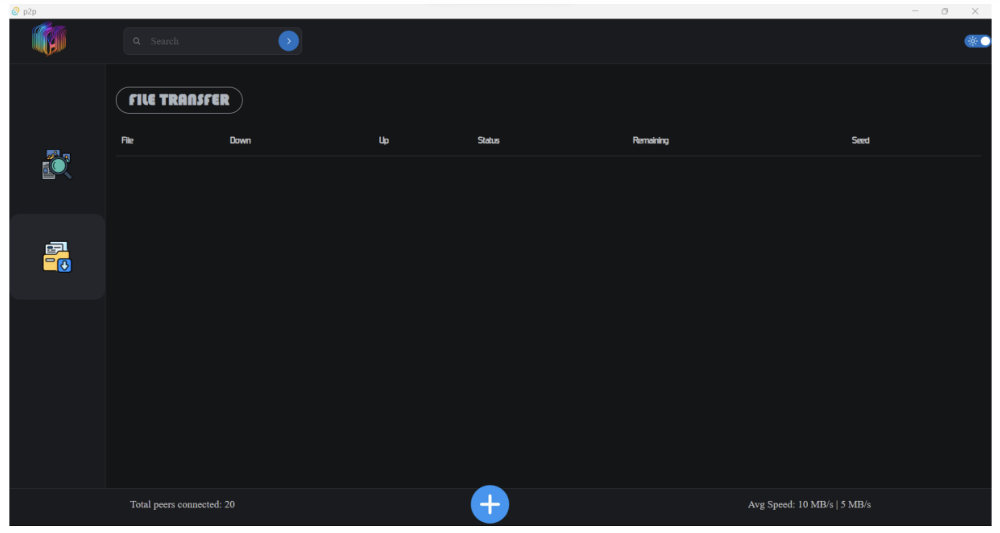

# P2P File Sharing App

## Overview
This project is a **peer-to-peer (P2P) file-sharing application** built using **Tauri** for lightweight desktop application development, along with a frontend powered by JavaScript/TypeScript. The application enables seamless file sharing between users without relying on a centralized server.

## Features
- **Decentralized File Sharing**: Peer-to-peer network for direct file transfers.
- **Cross-Platform Support**: Runs on Windows, macOS, and Linux.
- **Secure and Fast**: Uses modern encryption methods for secure file transfers.
- **Lightweight and Efficient**: Built with **Tauri**, ensuring low resource usage.
- **User-Friendly Interface**: Easy-to-use UI for selecting and sharing files.

## Technologies Used
- **Frontend:** JavaScript/TypeScript (React/Vue/Svelte)
- **Backend:** Rust (via Tauri framework)
- **Networking:** WebRTC / TCP for peer-to-peer connections
- **UI Frameworks:** TailwindCSS / Material UI

## Installation
### Prerequisites
- **Node.js** (for frontend development)
- **Rust & Cargo** (for building the Tauri app)
- **Yarn or npm** (for package management)

### Steps
1. Clone the repository:
   ```sh
   git clone https://github.com/yourusername/p2p-filesharing.git
   cd p2p-filesharing
   ```
2. Install dependencies:
   ```sh
   yarn install  # or npm install
   ```
3. Run the development server:
   ```sh
   yarn tauri dev  # or npm run tauri dev
   ```
4. Build the application:
   ```sh
   yarn tauri build  # or npm run tauri build
   ```

## Usage
1. Open the application.
2. Select a file to share.
3. Generate a unique sharing link or QR code.
4. The receiver enters the link or scans the QR code to download the file.

## Screenshots
## DEMO IMAGES



## Contributing
Contributions are welcome! Please follow these steps:
1. Fork the repository.
2. Create a new branch (`feature-branch`).
3. Commit your changes.
4. Push to your fork and submit a pull request.

## License
This project is licensed under the **MIT License**.

## Contact
For any issues or feature requests, feel free to open an issue or contact the maintainer.

